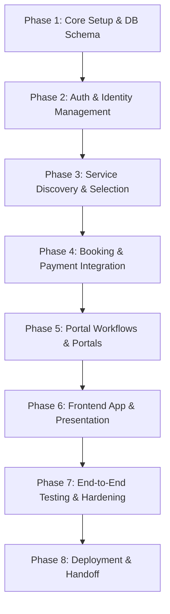

# Cleanzy Development Action Plan

This document establishes the structured roadmap and execution plan for the development of **Cleanzy**—the Online Housekeeping Management Platform. This plan is derived directly from the architectural guardrails, database schemas, business workflows, and coding standards outlined in the `context/` directory.

---

## 1. System Context & Guardrails Reference
To maintain the integrity of the platform during development, all phases must strictly adhere to the following rules established in `01_system_architecture.md` and `04_coding_standards.md`:
* **Separation of Concerns:** The `:App` layer (frontend/presentation) is restricted to request/response logic and must never query the `:Database` directly. All data access must go through the `:Backend`.
* **State Machine Integrity:** The booking status must **never** transition to `Confirmed` without a direct, authenticated callback from the `3rd Party Payment Gateway` (Phase B Workflow).
* **Environment Cleanliness:** All runtime logs, API dumps, and temporary scratch files must live exclusively within `context/dump/`. The root directory must remain clutter-free.
* **Strong Typing:** All system models must map one-to-one with the schema defined in `02_database_schema.md`.

---

## 2. Phased Development Roadmap

### Phase 1: Core Infrastructure & Database Schema Initialization
**Goal:** Establish the repository structure, base configuration, and database layer.
* **1.1. Project Skeleton:**
  * Initialize monorepo or separated frontend/backend structures.
  * Configure linters, formatters, and strict environment control.
  * Create sandbox configurations targeting `context/dump/` for logging.
* **1.2. Database Configuration:**
  * Spin up PostgreSQL (or similar SQL DBMS supporting UUIDs).
  * Design database migrations matching the schema defined in `02_database_schema.md` (`USER`, `STAFF`, `SERVICE`, `BOOKING`, `PAYMENT`, `ATTENDANCE`, `FEEDBACK`, `NOTIFICATION`).
  * Enforce foreign key constraints, default values, and indexes (especially on `Staff_ID`, `Client_ID`, and booking times).
* **1.3. Type Definitions & Models:**
  * Code explicit type definitions and data validation schemas (e.g., Zod, Pydantic, or native language interfaces) matching the exact schema properties.
* **1.4. Data Seeding:**
  * Write seed scripts to populate initial `SERVICE` options and simulated `STAFF` records with coordinates for discovery testing.

### Phase 2: Authentication, Identity, & Session Management
**Goal:** Set up secure access control and identity management for the three target actors.
* **2.1. Registration & Authentication APIs:**
  * Develop secure signup/login endpoints for `USER` and `STAFF` (workers).
  * Implement password hashing (e.g., bcrypt) and JWT-based session token issuance.
* **2.2. Role-Based Access Control (RBAC):**
  * Implement middleware to protect backend routes based on user role (`User`, `Worker`, `Administrator`).
  * Secure endpoints so workers cannot modify other workers' records, users cannot access administrative dashboards, and only administrators can access staff holidays and complaints.
* **2.3. User & Worker Profile APIs:**
  * Establish CRUD operations for `USER` address/profile info and `STAFF` skill types/availability.

### Phase 3: Service Discovery & Prequalification (Phase A Workflow)
**Goal:** Build the search and presentation layer where customers find services and match with staff.
* **3.1. Service Search & Filter API:**
  * Endpoint for clients to request service offerings based on `Service_ID` and desired schedule.
* **3.2. Worker Matching Logic:**
  * Query the database for active, available workers (`Availability = true`) matching the required `Skill_Type`.
  * Implement location-based proximity calculations or simple sorting based on worker `Rating` and scheduling constraints.
* **3.3. Booking Choice Generator:**
  * Compute candidate worker schedules, estimated base pricing (from `SERVICE.Base_Price`), and present options to the App layer.
* **3.4. Verification:**
  * Write integration tests validating that queries only return available workers matching the requested service criteria.

### Phase 4: Booking Engine & Payment Gateway Integration (Phase B Workflow)
**Goal:** Implement the critical transactional flow for booking commitments, payment processing, and secure state transition.
* **4.1. Booking Creation (Pending State):**
  * Create an endpoint for committing to a booking. Inserts a record into the `BOOKING` table with a status of `Pending` or `Payment_Required`.
* **4.2. Payment Gateway Hookup:**
  * Integrate backend-initiated handshake with the 3rd Party Payment Gateway.
  * Generate a secure checkout session or payment intent.
* **4.3. Payment Callback/Webhook Receiver:**
  * Implement a secure, signature-validated callback endpoint on the backend.
  * Listen for authorization events (`payment_intent.succeeded` or equivalent) from the Payment Gateway.
* **4.4. State Machine Transition & Validation:**
  * **Strict Check:** Enforce that booking status transitions to `Confirmed` *only* upon receipt and validation of the payment callback.
  * Persist the transaction metadata in the `PAYMENT` table.
* **4.5. Fail-Safe Mechanics:**
  * Implement cleanup jobs/timeouts for bookings stuck in a pending state without payment authorization.

### Phase 5: Portal Workflows & Supporting Subsystems
**Goal:** Complete the business workflows specific to workers and administrators.
* **5.1. Attendance & Shift Management:**
  * Implement `Check-In` and `Check-Out` API for workers (`ATTENDANCE` table).
* **5.2. Admin Management Interfaces:**
  * Endpoints to view system-wide bookings.
  * Salary calculation hooks and worker holiday management APIs.
  * Complaint management workflows.
* **5.3. Feedback & Rating Loop:**
  * Establish post-booking rating system.
  * Implement triggers updating the `Rating` field in the `STAFF` table when `FEEDBACK` is submitted.
* **5.4. Notification Pipeline:**
  * Create backend dispatchers that log records to the `NOTIFICATION` table for booking updates, payment failures, and assignments.

### Phase 6: Frontend App & Presentation Layer
**Goal:** Build the interface for the three user roles, connecting elements to the backend APIs.
* **6.1. Customer Interface (User):**
  * Search service catalogue, view worker ratings/profiles, and request bookings.
  * Secure checkout redirection and booking receipt confirmation view.
  * My Bookings & feedback forms.
* **6.2. Worker Portal Interface:**
  * Dashboard showing upcoming/past bookings.
  * Accept/Confirm booking assignments.
  * Punch card for Attendance (Check-in/Check-out).
* **6.3. Administrator Panel:**
  * Visual overview of bookings, staff distribution, and customer complaints.
  * Staff profile, availability, and holiday management screens.

### Phase 7: Quality Assurance, Hardening & Security Testing
**Goal:** Run comprehensive tests to ensure validation, state transition logic, and security are sound.
* **7.1. State Machine & Workflows Verification:**
  * Assert that it is programmatically impossible to transition bookings to `Confirmed` without a valid gateway signature/callback payload.
* **7.2. Boundary & RBAC Audits:**
  * Conduct API scanning to verify that frontend tokens cannot bypass business rules and that actors cannot access endpoints outside their scopes.
* **7.3. Concurrency & Performance Check:**
  * Test concurrent booking requests for the same worker at the same slot. Prevent double-booking.

### Phase 8: Deployment & Handoff Protocols
**Goal:** Securely launch the platform and establish handoff checkpoints.
* **8.1. Production Database & API Deployments:**
  * Setup CI/CD automation.
  * Deploy database migrations to the production environment.
* **8.2. Session Checkpointing:**
  * Maintain readiness to execute the Handoff Strategy defined in `05_handoff_strategy.md` by writing `handoff.md` at the project root upon session exit or handover commands.

---

## 3. Verification & Compliance Matrix

| Requirement / Guardrail | Implementation Phase | Verification Method |
| :--- | :--- | :--- |
| No direct database access from App | Phase 1 & 6 | Static code analysis; Network configuration constraints |
| State-locked Confirmed Booking | Phase 4 | Automated test simulating mock payment callback failure |
| Sandbox clean-up rule | Phase 1 | Checking git status to verify no logs exist outside `context/dump/` |
| Strong schema validation | Phase 1 & 3 | Unit tests injecting bad schemas / partial payloads |
| Worker role isolation | Phase 2 & 5 | RBAC penetration tests using customer JWT tokens on worker paths |
